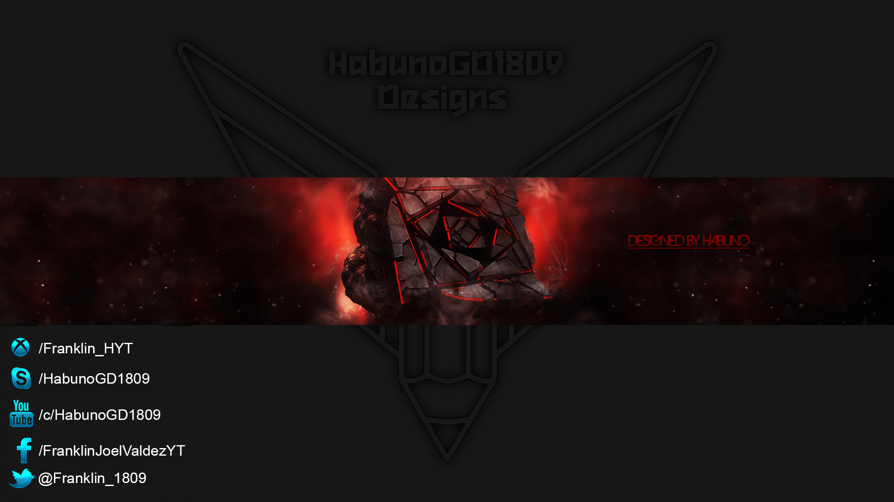

# <div align="center">👋 Welcome, I'm Franklin J.!</div>



<div align="center">
  
</div>

<div align="center">
  
  [](https://www.youtube.com/c/HabunoGD1809)
  [](https://twitter.com/HabunoGD1809)
  [](https://www.instagram.com/HabunoGD1809/)
  [](https://www.facebook.com/HabunoGD1809YT)
  
</div>

## 🚀 About Me

```javascript
const franklin = {
    pronouns: "he" | "him",
    code: ["JavaScript", "Python", "Java", "C#", "PostgreSQL"],
    currentFocus: "Software Development",
    passions: ["Creating Quality Software", "Open Source", "Problem Solving"],
    funFact: "I love turning coffee into code! ☕️"
};
```

<div align="center">
  
</div>

## 🛠️ Tech Stack

<div align="center">

### Languages


### Frameworks & Libraries


### Databases


### Development Tools


### Design


</div>

## 📊 GitHub Stats

<div align="center">
  
  <br/>
  
</div>

## 🚀 Featured Projects

<div align="center">

### Mobile Development

> Building cross-platform mobile applications with Flutter and Firebase

### Web Development

> Creating responsive and interactive web applications

### Backend Development

> Developing robust server-side applications and APIs

</div>

<!-- YOUTUBE:START -->
- [UNLOCK PRACTICE MUSIC - Geometry Dash 2.2](https://www.youtube.com/watch?v=6qps8P1p4Lw)
- [Examen II - Aplicacion de Emergencia  911 en Flutter](https://www.youtube.com/watch?v=8_tM3g0p-0k)
- [La solución definitiva para ver YouTube sin anuncios con Adblock](https://www.youtube.com/watch?v=TywqvQAnMds)
- [APLICACIONES MOVILES [2023]](https://www.youtube.com/watch?v=mXstidkMmZk)
- [Valores esenciales](https://www.youtube.com/watch?v=mbBvyBAho7s)
<!-- YOUTUBE:END -->

## 📫 Let's Connect

<div align="center">
  <a href="mailto:franklinjoel1821@gmail.com">
    
  </a>
  <a href="https://www.linkedin.com/in/franklinjv/">
    
  </a>
  <a href="https://github.com/HabunoGD1809">
    
  </a>
</div>

## 🐍 A Snake Eating My Contributions

<picture>
  <source media="(prefers-color-scheme: dark)" srcset="https://raw.githubusercontent.com/HabunoGD1809/HabunoGD1809/output/github-contribution-grid-snake-dark.svg" />
  <source media="(prefers-color-scheme: light)" srcset="https://raw.githubusercontent.com/HabunoGD1809/HabunoGD1809/output/github-contribution-grid-snake.svg" />
  
</picture>

<div align="center">
  
</div>

<div align="center">
  
</div>
